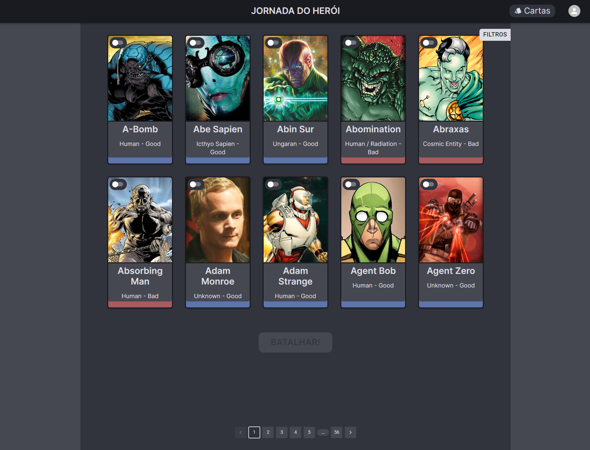
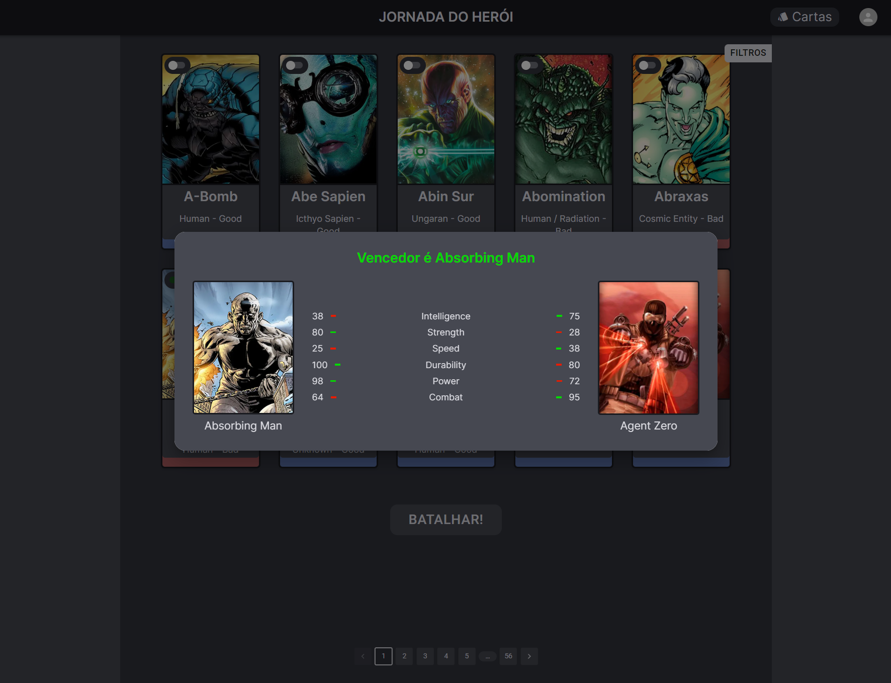
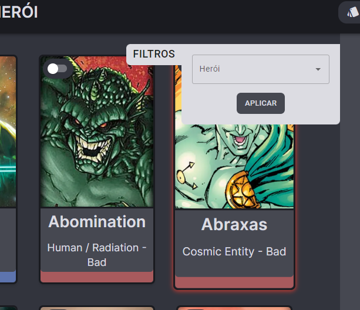

# Azapy-ProcessoSeletivo

# Visão Geral do Projeto

Este é um projeto que usa React, Typescript, Next, Material-UI e TailwindCSS.
É uma stack de desenvolvimento web moderna que é rápida e eficiente para construir aplicativos web escaláveis.

# Preview

O projeto é um deck de super-heróis fornecido pela Azapy. Existe a listagem desses heróis e o modo de combate, que compara os `powerstats` de cada herói para decidir quem irá ganhar uma batalha.

# Telas

## Deck

## Batalha

## Filtros

# Começando

Para iniciar o projeto, siga os passos abaixo:

- Clone o repositório em sua máquina local
- Execute npm install para instalar as dependências do projeto (utilizado node v20.1.0 e npm v9.6.6)
- Execute npm run dev para iniciar o servidor de desenvolvimento
- Abra seu navegador e acesse http://localhost:3000/ para ver a aplicação funcionando

# Tecnologias e Funcionalidades

## Tecnologias

O projeto inclui as seguintes tecnologias:

- React para construir interfaces de usuário reativas
- TypeScript para desenvolvimento, escalabilidade e segurança de tipo
- NextJS como

# Funcionalidades

O projeto possui as seguintes funcionalidades:

- Ver os personagens aos poucos, com paginação
- Permitir ao usuário filtrar o herói
- Permitir ao usuário escolher 2 heróis para um combate

# Scripts

O projeto inclui os seguintes scripts:

- `npm run dev`: Inicia o servidor de desenvolvimento
- `npm run build`: Builda o aplicativo pronto para produção
- `npm run lint`: Linta e corrige os arquivos
- `npm run start`: Inicia o servidor de produção
